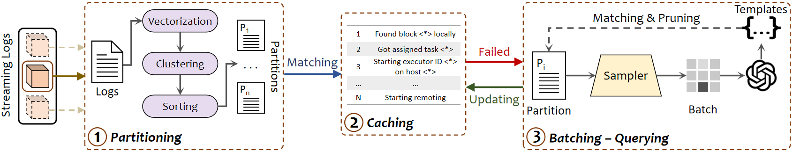

# LogBatcher
[](https://pypi.org/project/logbatcher/)
[](https://github.com/LogIntelligence/LogBatcher/actions/workflows/build_and_test.yml)
[](https://github.com/LogIntelligence/LogBatcher/actions/workflows/python-publish.yml)
[](https://pepy.tech/projects/logbatcher)


**LogBatcher** is a cost-effective LLM-based log parser that requires no training process or labeled data. This repository includes artifacts for reuse and reproduction of experimental results presented in our ASE'24 paper titled *"Demonstration-Free: Towards More Practical Log Parsing with Large Language Models"*.

## Work Flow

Log Batcher contians three main components: **Partitioning, Caching and Batching - Querying** 


**Table of Contents**
  - [Setup](#setup)
    - [Get start](#get-start)
    - [Project Tree](#project-tree)
  - [Usage](#usage)
    - [Data format](#data-format)
    - [Usage example](#usage-example)
    - [Example Evaluation](#example-evaluation)
  - [Benchmark](#benchmark)
    - [Prepare datasets](#prepare-datasets)
    - [Reproduce](#reproduce)
    - [Benchmark Evaluation](#benchmark-evaluation)
  

## Setup


### Get start

_To run at the local environment:_

Git Clone LogBatcher from github
```bash
git clone https://github.com/LogIntelligence/LogBatcher.git && cd LogBatcher
```

The code is implemented in **Python >= 3.9**. To install the required packages, run the following command (conda is optional):
```bash
conda create -n logbatcher python==3.9
conda activate logbatcher
pip install -r requirements.txt
```

Install LogBatcher from PyPI
```bash
pip install logbatcher
```

OR, Install LogBatcher from source
```bash
pip install -e .
```

Set your **API Key** in `config.json`

Note that if you find the access to specific API versions is lost, please refer to the following:

To ensure the long-term reusability of LogBatcher, we recommend using OpenAI's latest released models. For example, as indicated on [Open AI](https://platform.openai.com/docs/deprecations), the GPT-3.5 series is soon to be deprecated, and it is recommended to switch to the newer gpt-4o-mini model. Additionally, we also support the open-source LLMs as the base model. You can use the API provided by [Together AI](https://www.together.ai/) to replace LogBatcher's base model with their commercially available open-source models (such as LLama 3.1, etc.).

```json
"api_key_from_openai": "<OpenAI_API_KEY>",
"api_key_from_together":"<Together_API_KEY>",
```

_To run with docker:_

Download the pre-installed docker image from our Zenodo repository, which also includes the source code, benchmarks and scripts.

Zenodo repository DOI: [](https://doi.org/10.5281/zenodo.13752709)

Running the following command after downloading the pre-built Docker image:

```bash
docker load -i logbatcher.tar
docker images
docker run -it logbatcher
```

Or you can build the docker image from the `Dockerfile` we provide:
```bash
docker build -t logbatcher .
docker images
docker run -it logbatcher
```

### Project Tree

```
📦LogBatcher
 ┣ 📂datasets
 ┃ ┣ 📂loghub-2k
 ┃ ┃ ┣ 📂Android
 ┃ ┃ ┃ ┣ 📜Android_2k.log
 ┃ ┃ ┃ ┣ 📜Android_2k.log_structured.csv
 ┃ ┃ ┃ ┣ 📜Android_2k.log_templates.csv
 ┃ ┃ ┃ ┣ 📜Android_2k.log_structured_corrected.csv
 ┃ ┃ ┃ ┗ 📜Android_2k.log_templates_corrected.csv
 ┃ ┃ ┣ ...
 ┃ ┗ 📂loghub-2.0
 ┣ 📂evaluation
 ┃ ┣ 📂utils
 ┃ ┣ 📜logbatcher_eval.py
 ┃ ┗ 📜settings.py
 ┣ 📂logbatcher
 ┃ ┣ 📜additional_cluster.py
 ┃ ┣ 📜cluster.py
 ┃ ┣ 📜parser.py
 ┃ ┣ 📜matching.py
 ┃ ┣ 📜parsing_base.py
 ┃ ┣ 📜postprocess.py
 ┃ ┣ 📜sample.py
 ┃ ┗ 📜util.py
 ┣ 📂outputs
 ┃ ┣ 📂figures
 ┃ ┗ 📂parser
 ┣ 📜README.md
 ┣ 📜benchmark.py
 ┣ 📜config.json
 ┣ 📜requirements.txt
 ┗ 📜demo.py
```

## Usage

### Data format

LogBatcher mainly takes **a raw log file** (in plain text format) as input and outputs the **parsed log file** (in CSV format). A **raw log file** is a log file with each line representing a complete log. 

Following the data format from [LOGPAI](https://github.com/logpai/loghub), the data can also be a **structured log file**. A **structured log file** is a CSV file that includes at least the `LineID` and `Content` columns for parsing, with optional `EventID` and `EventTemplate` columns for evaluation.

### Usage example

We provide a usage example for more convenient reuse, which is presented as follows. The usage example can be found in file `demo.py`. The example provides a test on a specific dataset **Apache** from [LOGPAI](https://github.com/logpai/loghub). If you want to evaluate LogBatcher on your own dataset, please replace the arguments `file_name` and `dataset_format` with your own raw log file path to load log data and the corresponding dataset format to extract the contents. Run `python demo.py` and find the results in `outputs/parser/test` folder.

```python
import json
from logbatcher.parsing_base import single_dataset_paring
from logbatcher.parser import Parser
from logbatcher.util import data_loader

# load api key, dataset format and parser
model, dataset, folder_name ='gpt-3.5-turbo-0125', 'Apache', 'test'
config = json.load(open('config.json', 'r'))
parser = Parser(model, folder_name, config)

# load contents from raw log file, structured log file or content list
contents = data_loader(
    file_name=f"datasets/loghub-2k/{dataset}/{dataset}_2k.log",
    dataset_format= config['datasets_format'][dataset],
    file_format ='raw'
)

# parse logs
single_dataset_paring(
    dataset=dataset,
    contents=contents,
    output_dir= f'outputs/parser/{folder_name}/',
    parser=parser,
    debug=False
)
```

<details>
<summary>Expected output</summary>

```
python demo.py
Parsing 2000 logs in dataset Apache...
100%|██████████████████████████████████| 2000/2000 [00:04<00:00, 420.55log/s]
parsing time: 4.756490230560303
idetified templates: 6
```
</details>

### Example Evaluation

To evaluate the output of the usage example, run the following command
```bash
cd evaluation && python logbatcher_eval.py --config test --dataset Apache
```

<details>
<summary>Expected output</summary>


```
Calculating Edit Distance....
100%|███████████████████████████████████████████████████████████| 2000/2000 [00:00<00:00, 4029110.47it/s]
Normalized_Edit_distance (NED): 1.0000, ED: 0.0000,
Grouping Accuracy calculation done. [Time taken: 0.002]
Start compute grouping accuracy
100%|███████████████████████████████████████████████████████████| 6/6 [00:00<00:00, 2084.64it/s]
Grouping_Accuracy (GA): 1.0000, FGA: 1.0000,
Grouping Accuracy calculation done. [Time taken: 0.006]
Parsing_Accuracy (PA): 1.0000
Parsing Accuracy calculation done. [Time taken: 0.001]
100%|███████████████████████████████████████████████████████████| 6/6 [00:00<00:00, 10677.06it/s]
PTA: 1.0000, RTA: 1.0000 FTA: 1.0000
Identify : 6, Groundtruth : 6
Template-level accuracy calculation done. [Time taken: 0.003]
```
</details>

The results of evaluation metrics can be found in `outputs/parser/test` folder

## Benchmark

### Prepare datasets

We have already provided _loghub-2k_ datasets in `datasets/loghub-2.0` folder.

if you want to benchmark on _Loghub-2.0_ datasets, please Run `datasets/loghub-2.0/download.sh` or download the datasets:


1. Datasets DOI: [](https://doi.org/10.5281/zenodo.8275861)
2. Datasets Homepage: [Loghub-2.0](https://zenodo.org/records/8275861)

### Reproduce

To benchmark on all datasets in loghub-2k or loghub-2.0, you can run the following commands:
```bash
python benchmark.py --data_type [DATATYPE] --model [MODEL] --batch_size [BATCHSIZE] --chunk_size [CHUNKSIZE] --sampling_method [SAMPLINGMETHOD]
```

The description of the arguments can be found in `benchmark.py` or below:

```bash
--data_type
  Datasets type, Options: ['2k', 'full'], default: '2k'.
--model
  the Large Lauguage model used in LogBatcher, default: 'gpt-3.5-turbo-0125'.
--batch_size
  size of a batch query, default: 10.
--chunk_size
  size of a log chunk, default: 2000.
--clustering_method
  clustering method used in the partitioning stage, Options: ['dbscan', 'meanshift', 'hierarchical'], default: 'dbscan'.
--sampling_method
  sampling method used in the batching stage, Options: ['dpp', 'similar', 'random'], default: 'dpp'.
```

### Benchmark Evaluation

To evaluate the output of benchmark, run the following command
```bash
cd evaluation && python logbatcher_eval.py --config logbatcher_2k
```


The expected results will be similar with that presented in the paper, also see [experimental_results](docs/experimental_results.md).


The description of the arguments:

```bash
--config
  The folder name of the outputs, Options: ['test', 'logbatcher_2k', 'logbatcher_full']
--data_type
  Datasets type, Options: ['2k', 'full'], default: '2k'
--dataset
  To evaluate on a single dataset, default: 'null'.
```
