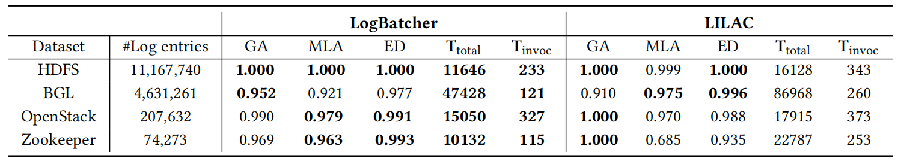

# LogBatcher
Repository for the paper: Demonstration-Free: Towards More Practical Log Parsing with Large Language Models

## Work Flow


In this work, we propose LogBatcher, a cost-effective LLM-based log parser that requires no training process or labeled data.
Log Batcher contians three main components: **Partitioning, Caching and Batching - Querying** 

## Setup

### 1.Library and Config
To satrt with LogBatcher, you need....

Install all library:
```shell
$ pip install -r requirements.txt
```
Upload your API Key in `config.json`:
```json
{
    "api_key_from_openai": "Your API Key from OpenAI"
}
```
### 2.Execution with Arguments

- To evaluate on smaller dataset with LogBatcher, execute:

```shell
python evaluation_2k.py --batch_size [batch size] --sampling_method [sampling method] --model [model]
```

- To perform online parsing on bigger dataset, add your log file to `dataset` and execute:
```shell
python evaluation_full.py --batch_size [batch size] --chunk_size [chunk size] --sampling_method [sampling method] --model [model]
```

The parsed result is stored in `outputs/parser`, along with results of evaluation metric.

## Results

### 1.Effectiveness, Robustness and Effeciency

- Accuracy comparison with the SOTA Log parsers
<p align="center"></p>

- Robustness comparison with the SOTA Log parsers
<p align="center"></p>

- Efficiency of LLM-based Log parsers
<p align="center"></p>

### 2.Ablation Study

We evaluate the importance of each component by removing each of them from the framework
<p align="center"></p>

### 3.Scalability

- Performance with demonstrations
<p align="center"></p>

- Performance on large-scale datasets
<p align="center"></p>

### 4.Different Settings

- Batch size
<p align="center"></p>

- Sampling method
<p align="center"></p>

- LLM selection
<p align="center"></p>
