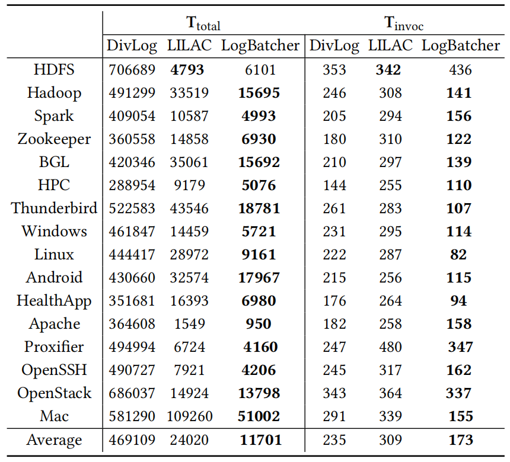
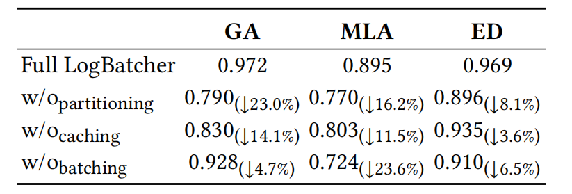
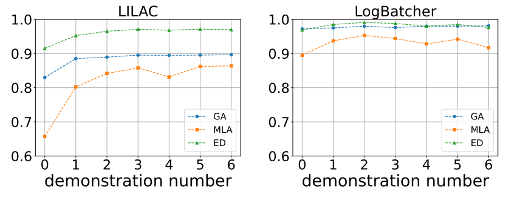

# LogBatcher
Repository for the paper: Demonstration-Free: Towards More Practical Log Parsing with Large Language Models

## Work Flow


In this work, we propose LogBatcher, a cost-effective LLM-based log parser that requires no training process or labeled data.
Log Batcher contians three main components: **Partitioning, Caching and Batching - Querying** 

# A1

<div style="text-align: center;">

|   **LILAC**  |   **GA**  |  **MLA**  |   **ED**  |  **FGA**  |  **FTA**  |
|:------------:|:---------:|:---------:|:---------:|:---------:|:---------:|
| **32 shots** |    0.909  |    0.812  |    0.972  |    0.951  |    0.839  |
| **16 shots** |    0.859  |    0.776  |    0.952  |    0.939  |    0.808  |
|  **8 shots** |    0.876  |    0.825  |    0.963  |    0.927  |    0.768  |
|  **4 shots** |    0.845  |    0.766  |    0.942  |    0.915  |    0.753  |
|  **2 shots** |    0.877  |    0.776  |    0.950  |    0.904  |    0.724  |
|  **1 shots** |    0.836  |    0.725  |    0.930  |    0.904  |    0.708  |
|  **0 shots** |    0.765  |    0.601  |    0.903  |    0.824  |    0.577  |

</div>


# A2

<div style="text-align: center;">

| **LoaBatcher** | **GA** | **MLA** |  **ED** | **FGA** | **FTA** |
|:--------------:|:------:|:-------:|:-------:|:-------:|:-------:|
|      **Test 1**     |  0.974 |  0.905  | 0.972 |   0.930  |  0.803  |
|      **Test 2**     |  0.974 |  0.898  | 0.971 |   0.930  |  0.796  |
|      **Test 3**     |  0.969 |  0.899  | 0.969 |  0.931  |  0.801  |
|      **Test 4**     |  0.974 |  0.914  | 0.974 |   0.93  |  0.808  |
|      **Test 5**     |  0.980  |  0.906  | 0.973 |  0.934  |  0.803  |

</div>

# A3

## (a)
Examples of nconsistent labels across log data in loghub-2.0 is shown below:
```
In dataset Linux and Thunderbird, there are similar logs contains:
`session opened for user cyrus by (uid=0)` and `session opened for user root by LOGIN(uid=0)`
In Linux the label of them is `session opened for user <*> by <*>(uid=<*>)`, while In Thunderbird it is `session opened for user <*> by <*>`
It raise another question about whether placeholder represents null value should appear:
Previous work labeled `connection from 84.139.180.196 (p548BB4C4.dip0.t-ipconnect.de) at Fri Jan 6 15:53:55 2006` and `connection from 84.139.180.196 () at Fri Jan 6 15:53:55 2006` into:
`connection from <*> (<*>) at <*>` and `connection from <*> () at <*>`, while loghub-2.0 use the same label `connection from <*> (<*>) at <*>` to cover both of them.

```

## (b)

## Setup

### 1.Library and Config
To satrt with LogBatcher, you need....

Install all library:
```bash
$ pip install -r requirements.txt
```
Upload your API Key in `config.json`:
```json
{
    "api_key_from_openai": "Your API Key from OpenAI"
}
```
### 2.Execution with Arguments

- To evaluate on smaller dataset with LogBatcher, execute:

```bash
python evaluation_2k.py --batch_size [batch size] --sampling_method [sampling method] --model [model]
```

- To perform online parsing on bigger dataset, add your log file to `dataset` and execute:
```shell
python evaluation_full.py --batch_size [batch size] --chunk_size [chunk size] --sampling_method [sampling method] --model [model]
```

The parsed result is stored in `outputs/parser`, along with results of evaluation metric.

## Results

### 1.Effectiveness, Robustness and Effeciency

- Accuracy comparison with the SOTA Log parsers
<p align="center"></p>

- Robustness comparison with the SOTA Log parsers
<p align="center"></p>

- Efficiency of LLM-based Log parsers
<p align="center"></p>

### 2.Ablation Study

We evaluate the importance of each component by removing each of them from the framework
<p align="center"></p>

### 3.Scalability

- Performance with demonstrations
<p align="center"></p>

- Performance on large-scale datasets
<p align="center"></p>

### 4.Different Settings

- Batch size
<p align="center"></p>

- Sampling method
<p align="center"></p>

- LLM selection
<p align="center"></p>
