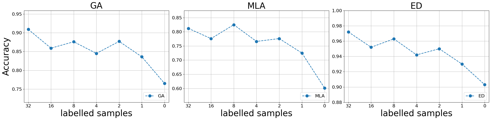

## Additional Results
### A1. Performance of LILAC with different numbers of demonstration

#### **Average results**

|   **LILAC**  |   **GA**  |  **MLA**  |   **ED**  |  **FGA**  |  **FTA**  |
|:------------:|:---------:|:---------:|:---------:|:---------:|:---------:|
| **32 shots** |    0.909  |    0.812  |    0.972  |    0.951  |    0.839  |
| **16 shots** |    0.859  |    0.776  |    0.952  |    0.939  |    0.808  |
|  **8 shots** |    0.876  |    0.825  |    0.963  |    0.927  |    0.768  |
|  **4 shots** |    0.845  |    0.766  |    0.942  |    0.915  |    0.753  |
|  **2 shots** |    0.877  |    0.776  |    0.950  |    0.904  |    0.724  |
|  **1 shots** |    0.836  |    0.725  |    0.930  |    0.904  |    0.708  |
|  **0 shots** |    0.765  |    0.601  |    0.903  |    0.824  |    0.577  |



#### **32 shots**

| **Dataset** | **Proxifier** | **Linux** | **Apache** | **Zookeeper** | **Hadoop** | **HealthApp** | **OpenStack** | **HPC** | **Mac** | **OpenSSH** | **Spark** | **Thunderbird** | **BGL** | **HDFS** | **Windows** | **Android** | **Average** |
|:-----------:|:-------------:|:---------:|:----------:|:-------------:|:----------:|:-------------:|:-------------:|:-------:|:-------:|:-----------:|:---------:|:---------------:|:-------:|:--------:|:-----------:|:-----------:|:-----------:|
|    **GA**   |     1.000     |   0.299   |   1.000    |     0.995     |   0.958    |     0.900     |     1.000     |  0.970  |  0.783  |    0.753    |   0.999   |      0.977      |  0.981  |  1.000   |    0.924    |    1.000    |    0.909    |
|    **MLA**   |     1.000     |   0.492   |   1.000    |     0.850     |   0.934    |     0.895     |     0.478     |  0.993  |  0.567  |    0.805    |   0.982   |      0.468      |  0.967  |  1.000   |    0.571    |    0.991    |    0.812    |
|    **ED**   |     1.000     |   0.950   |   1.000    |     0.990     |   0.970    |     0.980     |     0.960     |  1.000  |  0.880  |    0.980    |   1.000   |      0.950      |  0.990  |  1.000   |    0.910    |    1.000    |    0.972    |
|   **FGA**   |     1.000     |   0.956   |   1.000    |     0.970     |   0.896    |     0.939     |     1.000     |  0.967  |  0.854  |    0.941    |   0.958   |      0.923      |  0.953  |  1.000   |    0.865    |    1.000    |    0.951    |
|   **FTA**   |     1.000     |   0.761   |   1.000    |     0.871     |   0.651    |     0.871     |     0.927     |  0.879  |  0.619  |    0.863    |   0.817   |      0.662      |  0.919  |  1.000   |    0.705    |    0.880    |    0.839    |

#### **16 shots**

| **Dataset** | **Proxifier** | **Linux** | **Apache** | **Zookeeper** | **Hadoop** | **HealthApp** | **OpenStack** | **HPC** | **Mac** | **OpenSSH** | **Spark** | **Thunderbird** | **BGL** | **HDFS** | **Windows** | **Android** | **Average** |
|:-----------:|:-------------:|:---------:|:----------:|:-------------:|:----------:|:-------------:|:-------------:|:-------:|:-------:|:-----------:|:---------:|:---------------:|:-------:|:--------:|:-----------:|:-----------:|:-----------:|
|    **GA**   |     1.000     |   0.299   |   1.000    |     1.000     |   0.990    |     0.917     |     0.491     |  0.968  |  0.773  |    0.753    |   0.943   |      0.974      |  0.981  |  1.000   |    0.966    |    0.688    |    0.859    |
|    **MLA**   |     0.999     |   0.492   |   1.000    |     0.844     |   0.891    |     0.901     |     0.427     |  0.902  |  0.489  |    0.805    |   0.925   |      0.504      |  0.967  |  1.000   |    0.721    |    0.539    |    0.775    |
|    **ED**   |     1.000     |   0.950   |   1.000    |     0.990     |   0.970    |     0.960     |     0.890     |  0.960  |  0.870  |    0.980    |   0.990   |      0.960      |  0.990  |  1.000   |    0.940    |    0.780    |    0.952    |
|   **FGA**   |     1.000     |   0.948   |   1.000    |     1.000     |   0.955    |     0.959     |     0.952     |  0.935  |  0.830  |    0.941    |   0.917   |      0.890      |  0.958  |  1.000   |    0.893    |    0.852    |    0.939    |
|   **FTA**   |     0.917     |   0.774   |   1.000    |     0.920     |   0.679    |     0.797     |     0.857     |  0.804  |  0.530  |    0.863    |   0.778   |      0.694      |  0.890  |  1.000   |    0.743    |    0.685    |    0.808    |

#### **8 shots**

| **Dataset** | **Proxifier** | **Linux** | **Apache** | **Zookeeper** | **Hadoop** | **HealthApp** | **OpenStack** | **HPC** | **Mac** | **OpenSSH** | **Spark** | **Thunderbird** | **BGL** | **HDFS** | **Windows** | **Android** | **Average** |
|:-----------:|:-------------:|:---------:|:----------:|:-------------:|:----------:|:-------------:|:-------------:|:-------:|:-------:|:-----------:|:---------:|:---------------:|:-------:|:--------:|:-----------:|:-----------:|:-----------:|
|    **GA**   |     1.000     |   0.293   |   1.000    |     0.995     |   0.958    |     0.902     |     0.491     |  0.970  |  0.777  |    0.753    |   0.999   |      0.962      |  0.980  |  1.000   |    0.948    |    0.992    |    0.876    |
|    **MLA**   |     0.999     |   0.414   |   1.000    |     0.846     |   0.935    |     0.890     |     0.439     |  0.990  |  0.526  |    0.800    |   0.958   |      0.856      |  0.948  |  1.000   |    0.615    |    0.981    |    0.825    |
|    **ED**   |     1.000     |   0.900   |   1.000    |     0.990     |   0.970    |     0.960     |     0.910     |  1.000  |  0.880  |    0.980    |   0.990   |      0.960      |  0.980  |  1.000   |    0.910    |    0.990    |    0.964    |
|   **FGA**   |     1.000     |   0.927   |   1.000    |     0.916     |   0.896    |     0.959     |     0.952     |  0.967  |  0.845  |    0.941    |   0.958   |      0.833      |  0.940  |  1.000   |    0.854    |    0.842    |    0.927    |
|   **FTA**   |     0.917     |   0.664   |   1.000    |     0.822     |   0.660    |     0.851     |     0.833     |  0.835  |  0.545  |    0.784    |   0.732   |      0.511      |  0.829  |  1.000   |    0.690    |    0.614    |    0.768    |

#### **4 shots**

| **Dataset** | **Proxifier** | **Linux** | **Apache** | **Zookeeper** | **Hadoop** | **HealthApp** | **OpenStack** | **HPC** | **Mac** | **OpenSSH** | **Spark** | **Thunderbird** | **BGL** | **HDFS** | **Windows** | **Android** | **Average** |
|:-----------:|:-------------:|:---------:|:----------:|:-------------:|:----------:|:-------------:|:-------------:|:-------:|:-------:|:-----------:|:---------:|:---------------:|:-------:|:--------:|:-----------:|:-----------:|:-----------:|
|    **GA**   |     1.000     |   0.293   |   1.000    |     0.995     |   0.985    |     0.900     |     0.491     |  0.775  |  0.769  |    0.753    |   0.978   |      0.969      |  0.953  |  1.000   |    0.962    |    0.688    |    0.844    |
|    **MLA**   |     1.000     |   0.342   |   1.000    |     0.690     |   0.952    |     0.743     |     0.383     |  0.796  |  0.474  |    0.807    |   0.937   |      0.928      |  0.935  |  1.000   |    0.711    |    0.562    |    0.766    |
|    **ED**   |     1.000     |   0.880   |   1.000    |     0.980     |   0.980    |     0.900     |     0.790     |  0.960  |  0.870  |    0.980    |   0.990   |      0.980      |  0.970  |  1.000   |    0.930    |    0.850    |    0.941    |
|   **FGA**   |     1.000     |   0.894   |   1.000    |     0.916     |   0.914    |     0.939     |     0.941     |  0.886  |  0.828  |    0.941    |   0.824   |      0.872      |  0.922  |  1.000   |    0.904    |    0.852    |    0.915    |
|   **FTA**   |     1.000     |   0.553   |   1.000    |     0.841     |   0.633    |     0.707     |     0.776     |  0.773  |  0.475  |    0.902    |   0.588   |      0.615      |  0.862  |  1.000   |    0.744    |    0.574    |    0.753    |

#### **2 shots**

| **Dataset** | **Proxifier** | **Linux** | **Apache** | **Zookeeper** | **Hadoop** | **HealthApp** | **OpenStack** | **HPC** | **Mac** | **OpenSSH** | **Spark** | **Thunderbird** | **BGL** | **HDFS** | **Windows** | **Android** | **Average** |
|:-----------:|:-------------:|:---------:|:----------:|:-------------:|:----------:|:-------------:|:-------------:|:-------:|:-------:|:-----------:|:---------:|:---------------:|:-------:|:--------:|:-----------:|:-----------:|:-----------:|
|    **GA**   |     0.856     |   0.298   |   1.000    |     0.990     |   0.958    |     0.919     |     1.000     |  0.924  |  0.786  |    0.753    |   0.997   |      0.950      |  0.951  |  1.000   |    0.958    |    0.688    |    0.877    |
|    **MLA**   |     0.900     |   0.425   |   1.000    |     0.594     |   0.688    |     0.898     |     0.936     |  0.939  |  0.486  |    0.739    |   0.956   |      0.829      |  0.933  |  0.943   |    0.697    |    0.453    |    0.776    |
|    **ED**   |     0.990     |   0.910   |   1.000    |     0.980     |   0.930    |     0.950     |     0.980     |  1.000  |  0.860  |    0.970    |   0.970   |      0.950      |  0.970  |  1.000   |    0.930    |    0.810    |    0.950    |
|   **FGA**   |     0.769     |   0.943   |   1.000    |     0.857     |   0.896    |     0.980     |     1.000     |  0.921  |  0.829  |    0.941    |   0.866   |      0.817      |  0.905  |  1.000   |    0.888    |    0.852    |    0.904    |
|   **FTA**   |     0.769     |   0.672   |   1.000    |     0.571     |   0.585    |     0.805     |     0.854     |  0.764  |  0.467  |    0.824    |   0.657   |      0.547      |  0.813  |  0.929   |    0.722    |    0.611    |    0.724    |

#### **1 shot**

| **Dataset** | **Proxifier** | **Linux** | **Apache** | **Zookeeper** | **Hadoop** | **HealthApp** | **OpenStack** | **HPC** | **Mac** | **OpenSSH** | **Spark** | **Thunderbird** | **BGL** | **HDFS** | **Windows** | **Android** | **Average** |
|:-----------:|:-------------:|:---------:|:----------:|:-------------:|:----------:|:-------------:|:-------------:|:-------:|:-------:|:-----------:|:---------:|:---------------:|:-------:|:--------:|:-----------:|:-----------:|:-----------:|
|    **GA**   |     1.000     |   0.300   |   1.000    |     0.989     |   0.735    |     0.900     |     0.491     |  0.767  |  0.774  |    0.561    |   0.981   |      0.965      |  0.964  |  1.000   |    0.959    |    0.993    |    0.836    |
|    **MLA**   |     0.999     |   0.389   |   1.000    |     0.678     |   0.702    |     0.876     |     0.434     |  0.663  |  0.484  |    0.618    |   0.964   |      0.831      |  0.941  |  0.943   |    0.482    |    0.602    |    0.725    |
|    **ED**   |     1.000     |   0.930   |   1.000    |     0.920     |   0.790    |     0.950     |     0.910     |  0.920  |  0.870  |    0.970    |   1.000   |      0.950      |  0.980  |  1.000   |    0.910    |    0.790    |    0.931    |
|   **FGA**   |     1.000     |   0.961   |   1.000    |     0.843     |   0.818    |     0.939     |     0.952     |  0.851  |  0.841  |    0.885    |   0.917   |      0.890      |  0.872  |  1.000   |    0.856    |    0.846    |    0.904    |
|   **FTA**   |     0.917     |   0.638   |   1.000    |     0.686     |   0.512    |     0.694     |     0.833     |  0.598  |  0.487  |    0.769    |   0.750   |      0.622      |  0.793  |  0.929   |    0.645    |    0.462    |    0.708    |

#### **0 shot**

| **Dataset** | **Proxifier** | **Linux** | **Apache** | **Zookeeper** | **Hadoop** | **HealthApp** | **OpenStack** | **HPC** | **Mac** | **OpenSSH** | **Spark** | **Thunderbird** | **BGL** | **HDFS** | **Windows** | **Android** | **Average** |
|:-----------:|:-------------:|:---------:|:----------:|:-------------:|:----------:|:-------------:|:-------------:|:-------:|:-------:|:-----------:|:---------:|:---------------:|:-------:|:--------:|:-----------:|:-----------:|:-----------:|
|    **GA**   |     0.000     |   0.297   |   1.000    |     0.989     |   0.956    |     0.900     |     0.491     |  0.915  |  0.695  |    0.519    |   0.998   |      0.951      |  0.879  |  1.000   |    0.958    |    0.686    |    0.765    |
|    **MLA**   |     0.286     |   0.344   |   1.000    |     0.300     |   0.773    |     0.868     |     0.439     |  0.684  |  0.349  |    0.247    |   0.952   |      0.801      |  0.798  |  1.000   |    0.484    |    0.292    |    0.601    |
|    **ED**   |     0.830     |   0.880   |   1.000    |     0.890     |   0.920    |     0.950     |     0.910     |  0.930  |  0.800  |    0.900    |   0.980   |      0.950      |  0.930  |  1.000   |    0.900    |    0.690    |    0.904    |
|   **FGA**   |     0.000     |   0.933   |   1.000    |     0.843     |   0.882    |     0.939     |     0.952     |  0.886  |  0.741  |    0.816    |   0.914   |      0.835      |  0.791  |  1.000   |    0.842    |    0.811    |    0.824    |
|   **FTA**   |     0.333     |   0.578   |   1.000    |     0.471     |   0.521    |     0.680     |     0.833     |  0.614  |  0.364  |    0.408    |   0.429   |      0.511      |  0.609  |  1.000   |    0.612    |    0.264    |    0.577    |

### A2. Performance of LogBatcher over 5 iterations


**Average Results**

| **LoaBatcher** | **GA** | **MLA** |  **ED** | **FGA** | **FTA** |
|:--------------:|:------:|:-------:|:-------:|:-------:|:-------:|
|      **Iteration 1**     |  0.974 |  0.905  | 0.972 |   0.930  |  0.803  |
|      **Iteration 2**     |  0.974 |  0.898  | 0.971 |   0.930  |  0.796  |
|      **Iteration 3**     |  0.969 |  0.899  | 0.969 |  0.931  |  0.801  |
|      **Iteration 4**     |  0.974 |  0.914  | 0.974 |   0.93  |  0.808  |
|      **Iteration 5**     |  0.980  |  0.906  | 0.973 |  0.934  |  0.803  |

#### Iteration 1

| **Dataset** | **Proxifier** | **Linux** | **Apache** | **Zookeeper** | **Hadoop** | **HealthApp** | **OpenStack** | **HPC** | **Mac** | **OpenSSH** | **Spark** | **Thunderbird** | **BGL** | **HDFS** | **Windows** | **Android** | **Average** |
|:-----------:|:-------------:|:---------:|:----------:|:-------------:|:----------:|:-------------:|:-------------:|:-------:|:-------:|:-----------:|:---------:|:---------------:|:-------:|:--------:|:-----------:|:-----------:|:-----------:|
|    **GA**   |     1.000     |   0.995   |   1.000    |     0.995     |   0.989    |     1.000     |     0.968     |  0.953  |  0.834  |    0.996    |   0.998   |      0.898      |  0.994  |  1.000   |    0.992    |    0.971    |    0.974    |
|    **MLA**   |     1.000     |   0.974   |   1.000    |     0.987     |   0.888    |     0.996     |     0.984     |  0.945  |  0.544  |    0.975    |   0.973   |      0.839      |  0.950  |  1.000   |    0.622    |    0.805    |    0.905    |
|    **ED**   |     1.000     |   0.992   |   1.000    |     0.995     |   0.952    |     0.999     |     0.996     |  0.996  |  0.890  |    0.989    |   0.982   |      0.938      |  0.992  |  1.000   |    0.865    |    0.966    |    0.972    |
|   **FGA**   |     1.000     |   0.951   |   1.000    |     0.916     |   0.933    |     1.000     |     0.788     |  0.913  |  0.888  |    0.941    |   0.928   |      0.861      |  0.975  |  1.000   |    0.913    |    0.849    |    0.928    |
|   **FTA**   |     1.000     |   0.711   |   1.000    |     0.785     |   0.753    |     0.973     |     0.808     |  0.761  |  0.555  |    0.824    |   0.783   |      0.644      |  0.832  |  1.000   |    0.718    |    0.702    |    0.803    |

#### Iteration 2

| **Dataset** | **Proxifier** | **Linux** | **Apache** | **Zookeeper** | **Hadoop** | **HealthApp** | **OpenStack** | **HPC** | **Mac** | **OpenSSH** | **Spark** | **Thunderbird** | **BGL** | **HDFS** | **Windows** | **Android** | **Average** |
|:-----------:|:-------------:|:---------:|:----------:|:-------------:|:----------:|:-------------:|:-------------:|:-------:|:-------:|:-----------:|:---------:|:---------------:|:-------:|:--------:|:-----------:|:-----------:|:-----------:|
|    **GA**   |     1.000     |   0.995   |   1.000    |     0.995     |   0.989    |     1.000     |     0.968     |  0.953  |  0.842  |    0.996    |   0.998   |      0.898      |  0.994  |  1.000   |    0.996    |    0.964    |    0.974    |
|    **MLA**   |     1.000     |   0.975   |   1.000    |     0.987     |   0.888    |     0.996     |     0.984     |  0.945  |  0.547  |    0.975    |   0.972   |      0.838      |  0.952  |  1.000   |    0.611    |    0.703    |    0.898    |
|    **ED**   |     1.000     |   0.992   |   1.000    |     0.995     |   0.952    |     0.999     |     0.996     |  0.996  |  0.894  |    0.989    |   0.982   |      0.938      |  0.992  |  1.000   |    0.863    |    0.947    |    0.971    |
|   **FGA**   |     1.000     |   0.951   |   1.000    |     0.916     |   0.933    |     1.000     |     0.788     |  0.913  |  0.898  |    0.941    |   0.912   |      0.861      |  0.975  |  1.000   |    0.941    |    0.831    |    0.929    |
|   **FTA**   |     1.000     |   0.729   |   1.000    |     0.785     |   0.753    |     0.973     |     0.808     |  0.761  |  0.554  |    0.824    |   0.735   |      0.638      |  0.832  |  1.000   |    0.667    |    0.677    |    0.796    |

#### Iteration 3

| **Dataset** | **Proxifier** | **Linux** | **Apache** | **Zookeeper** | **Hadoop** | **HealthApp** | **OpenStack** | **HPC** | **Mac** | **OpenSSH** | **Spark** | **Thunderbird** | **BGL** | **HDFS** | **Windows** | **Android** | **Average** |
|:-----------:|:-------------:|:---------:|:----------:|:-------------:|:----------:|:-------------:|:-------------:|:-------:|:-------:|:-----------:|:---------:|:---------------:|:-------:|:--------:|:-----------:|:-----------:|:-----------:|
|    **GA**   |     1.000     |   0.995   |   1.000    |     0.995     |   0.989    |     0.919     |     0.968     |  0.953  |  0.843  |    0.996    |   0.999   |      0.897      |  0.994  |  1.000   |    0.999    |    0.964    |    0.969    |
|    **MLA**   |     1.000     |   0.974   |   1.000    |     0.988     |   0.888    |     0.915     |     0.984     |  0.946  |  0.543  |    0.975    |   0.974   |      0.836      |  0.948  |  1.000   |    0.611    |    0.808    |    0.899    |
|    **ED**   |     1.000     |   0.992   |   1.000    |     0.995     |   0.952    |     0.961     |     0.996     |  0.996  |  0.892  |    0.989    |   0.983   |      0.938      |  0.988  |  1.000   |    0.863    |    0.961    |    0.969    |
|   **FGA**   |     1.000     |   0.951   |   1.000    |     0.916     |   0.933    |     0.980     |     0.788     |  0.913  |  0.899  |    0.941    |   0.958   |      0.847      |  0.975  |  1.000   |    0.970    |    0.830    |    0.931    |
|   **FTA**   |     1.000     |   0.711   |   1.000    |     0.804     |   0.753    |     0.953     |     0.808     |  0.783  |  0.558  |    0.824    |   0.817   |      0.617      |  0.824  |  1.000   |    0.673    |    0.687    |    0.801    |

#### Iteration 4

| **Dataset** | **Proxifier** | **Linux** | **Apache** | **Zookeeper** | **Hadoop** | **HealthApp** | **OpenStack** | **HPC** | **Mac** | **OpenSSH** | **Spark** | **Thunderbird** | **BGL** | **HDFS** | **Windows** | **Android** | **Average** |
|:-----------:|:-------------:|:---------:|:----------:|:-------------:|:----------:|:-------------:|:-------------:|:-------:|:-------:|:-----------:|:---------:|:---------------:|:-------:|:--------:|:-----------:|:-----------:|:-----------:|
|    **GA**   |     1.000     |   0.995   |   1.000    |     0.995     |   0.989    |     0.919     |     0.968     |  0.953  |  0.843  |    0.996    |   0.999   |      0.897      |  0.994  |  1.000   |    0.999    |    0.964    |    0.969    |
|    **MLA**   |     1.000     |   0.974   |   1.000    |     0.988     |   0.888    |     0.915     |     0.984     |  0.946  |  0.543  |    0.975    |   0.974   |      0.836      |  0.948  |  1.000   |    0.611    |    0.808    |    0.899    |
|    **ED**   |     1.000     |   0.992   |   1.000    |     0.995     |   0.952    |     0.961     |     0.996     |  0.996  |  0.892  |    0.989    |   0.983   |      0.938      |  0.988  |  1.000   |    0.863    |    0.961    |    0.969    |
|   **FGA**   |     1.000     |   0.951   |   1.000    |     0.916     |   0.933    |     0.980     |     0.788     |  0.913  |  0.899  |    0.941    |   0.958   |      0.847      |  0.975  |  1.000   |    0.970    |    0.830    |    0.931    |
|   **FTA**   |     1.000     |   0.711   |   1.000    |     0.804     |   0.753    |     0.953     |     0.808     |  0.783  |  0.558  |    0.824    |   0.817   |      0.617      |  0.824  |  1.000   |    0.673    |    0.687    |    0.801    |

#### Iteration 5

| **Dataset** | **Proxifier** | **Linux** | **Apache** | **Zookeeper** | **Hadoop** | **HealthApp** | **OpenStack** | **HPC** | **Mac** | **OpenSSH** | **Spark** | **Thunderbird** | **BGL** | **HDFS** | **Windows** | **Android** | **Average** |
|:-----------:|:-------------:|:---------:|:----------:|:-------------:|:----------:|:-------------:|:-------------:|:-------:|:-------:|:-----------:|:---------:|:---------------:|:-------:|:--------:|:-----------:|:-----------:|:-----------:|
|    **GA**   |     1.000     |   0.995   |   1.000    |     0.995     |   0.989    |     1.000     |     0.968     |  0.953  |  0.926  |    0.996    |   0.998   |      0.897      |  0.994  |  1.000   |    0.999    |    0.974    |    0.980    |
|    **MLA**   |     1.000     |   0.974   |   1.000    |     0.987     |   0.888    |     0.995     |     0.984     |  0.946  |  0.552  |    0.975    |   0.971   |      0.837      |  0.949  |  1.000   |    0.615    |    0.823    |    0.906    |
|    **ED**   |     1.000     |   0.992   |   1.000    |     0.995     |   0.951    |     0.999     |     0.996     |  0.996  |  0.900  |    0.989    |   0.981   |      0.938      |  0.989  |  1.000   |    0.863    |    0.973    |    0.973    |
|   **FGA**   |     1.000     |   0.951   |   1.000    |     0.925     |   0.933    |     1.000     |     0.788     |  0.913  |  0.910  |    0.941    |   0.912   |      0.847      |  0.975  |  1.000   |    0.970    |    0.875    |    0.934    |
|   **FTA**   |     1.000     |   0.711   |   1.000    |     0.792     |   0.753    |     0.960     |     0.808     |  0.783  |  0.553  |    0.824    |   0.706   |      0.623      |  0.840  |  1.000   |    0.752    |    0.744    |    0.803    |

### A3. Performance of LogBatcher on larger datasets

<!-- ## (a)
Examples of nconsistent labels across log data in loghub-2.0 is shown below:
```
In dataset Linux and Thunderbird, there are similar logs contains:
`session opened for user cyrus by (uid=0)` and `session opened for user root by LOGIN(uid=0)`
In Linux the label of them is `session opened for user <*> by <*>(uid=<*>)`, while In Thunderbird it is `session opened for user <*> by <*>`
It raises another question about whether placeholder represents null value should appear:
Previous work labeled `connection from 84.139.180.196 (p548BB4C4.dip0.t-ipconnect.de) at Fri Jan 6 15:53:55 2006` and `connection from 84.139.180.196 () at Fri Jan 6 15:53:55 2006` into:
`connection from <*> (<*>) at <*>` and `connection from <*> () at <*>`, while loghub-2.0 use the same label `connection from <*> (<*>) at <*>` to cover both of them.

In dataset HPC, loghub-2.0 labels:
`PSU status ( on off )` -> `PSU status ( <*> <*> )`
`Fan speeds ( 3552 3552 3391 4245 3515 3497 )` -> `Fan speeds ( <*> )`
It raise a question about whether to merge continous placeholders.
also some uncorrected labels happened:
`ambient=40 threshold exceeded` -> `ambient=<*>`

In dataset Hadoop
`TaskAttempt: [attempt_1445087491445_0005_m_000009_0] using containerId: [container_1445087491445_0005_01_000009] on NM: [04DN8IQ.fareast.corp.microsoft.com:55452]`
-> `TaskAttempt: [<*>] using containerId: [<*>] on NM: [<*>]`
`Failed to renew lease for [DFSClient_NONMAPREDUCE_483047941_1] for 46 seconds. Will retry shortly ...`
-> `Failed to renew lease for <*> for <*> seconds. Will retry shortly ...`
It raises a question about whether to include brackets in placeholders.
``` -->

<!-- ## (b)
<div style="text-align: center; display: flex; justify-content: space-between;">

| **Dataset** | **HPC** | **Proxifier** | **Spark** | **OpenSSH** |
|---------|:-------:|:-------------:|:---------:|:-----------:|
|  **GA** |  0.992  |     1.000     |   0.974   |    0.967    |
| **MLA** |  0.990  |     1.000     |   0.997   |    0.998    |
|  **ED** |  0.997  |     1.000     |   0.999   |    0.999    |
| **FGA** |  0.888  |     1.000     |   0.832   |    0.800    |
| **FTA** |  0.838  |     1.000     |   0.702   |    0.800    |

</div> -->

#### Results on 14 large-scale datasets from Loghub-2.0 

<style type="text/css">
.tg  {border-collapse:collapse;border-spacing:0;}
.tg td{border-color:black;border-style:solid;border-width:1px;font-family:Arial, sans-serif;font-size:14px;
  overflow:hidden;padding:10px 5px;word-break:normal;}
.tg th{border-color:black;border-style:solid;border-width:1px;font-family:Arial, sans-serif;font-size:14px;
  font-weight:normal;overflow:hidden;padding:10px 5px;word-break:normal;}
.tg .tg-c3ow{border-color:inherit;text-align:center;vertical-align:top}
.tg .tg-fymr{border-color:inherit;font-weight:bold;text-align:left;vertical-align:top}
.tg .tg-7btt{border-color:inherit;font-weight:bold;text-align:center;vertical-align:top}
</style>
<table class="tg"><thead>
  <tr>
    <th class="tg-fymr"></th>
    <th class="tg-fymr"></th>
    <th class="tg-7btt" colspan="7">LILAC w/o ICL</th>
    <th class="tg-7btt" colspan="7">LILAC</th>
    <th class="tg-7btt" colspan="7">LogBatcher</th>
  </tr></thead>
<tbody>
  <tr>
    <td class="tg-7btt">Datasets</td>
    <td class="tg-7btt">#Logs</td>
    <td class="tg-7btt">GA</td>
    <td class="tg-7btt">FGA</td>
    <td class="tg-7btt">MLA</td>
    <td class="tg-7btt">FTA</td>
    <td class="tg-7btt">ED</td>
    <td class="tg-7btt">T_total</td>
    <td class="tg-7btt">T_invoc</td>
    <td class="tg-7btt">GA</td>
    <td class="tg-7btt">FGA</td>
    <td class="tg-7btt">MLA</td>
    <td class="tg-7btt">FTA</td>
    <td class="tg-7btt">ED</td>
    <td class="tg-7btt">T_total</td>
    <td class="tg-7btt">T_invoc</td>
    <td class="tg-7btt">GA</td>
    <td class="tg-7btt">FGA</td>
    <td class="tg-7btt">MLA</td>
    <td class="tg-7btt">FTA</td>
    <td class="tg-7btt">ED</td>
    <td class="tg-7btt">T_total</td>
    <td class="tg-7btt">T_invoc</td>
  </tr>
  <tr>
    <td class="tg-7btt">HDFS</td>
    <td class="tg-c3ow">11,167,740</td>
    <td class="tg-c3ow">1.000 </td>
    <td class="tg-c3ow">0.658 </td>
    <td class="tg-c3ow">0.948 </td>
    <td class="tg-c3ow">0.575 </td>
    <td class="tg-c3ow">0.999 </td>
    <td class="tg-c3ow">5036</td>
    <td class="tg-c3ow">187</td>
    <td class="tg-c3ow">1.000 </td>
    <td class="tg-c3ow">0.968 </td>
    <td class="tg-c3ow">0.999 </td>
    <td class="tg-c3ow">0.946 </td>
    <td class="tg-c3ow">1.000 </td>
    <td class="tg-c3ow">16128</td>
    <td class="tg-c3ow">343</td>
    <td class="tg-c3ow">1.000 </td>
    <td class="tg-c3ow">0.913 </td>
    <td class="tg-c3ow">0.948 </td>
    <td class="tg-c3ow">0.826 </td>
    <td class="tg-c3ow">0.994 </td>
    <td class="tg-c3ow">10276</td>
    <td class="tg-c3ow">214</td>
  </tr>
  <tr>
    <td class="tg-7btt">Hadoop</td>
    <td class="tg-c3ow">179,993</td>
    <td class="tg-c3ow">0.915 </td>
    <td class="tg-c3ow">0.915 </td>
    <td class="tg-c3ow">0.840 </td>
    <td class="tg-c3ow">0.679 </td>
    <td class="tg-c3ow">0.960 </td>
    <td class="tg-c3ow">42120</td>
    <td class="tg-c3ow">183</td>
    <td class="tg-c3ow">0.872 </td>
    <td class="tg-c3ow">0.962 </td>
    <td class="tg-c3ow">0.832 </td>
    <td class="tg-c3ow">0.774 </td>
    <td class="tg-c3ow">0.947 </td>
    <td class="tg-c3ow">77464</td>
    <td class="tg-c3ow">335</td>
    <td class="tg-c3ow">0.947 </td>
    <td class="tg-c3ow">0.929 </td>
    <td class="tg-c3ow">0.802 </td>
    <td class="tg-c3ow">0.704 </td>
    <td class="tg-c3ow">0.937 </td>
    <td class="tg-c3ow">28685</td>
    <td class="tg-c3ow">117</td>
  </tr>
  <tr>
    <td class="tg-7btt">Spark</td>
    <td class="tg-c3ow">16,075,117</td>
    <td class="tg-c3ow">0.998 </td>
    <td class="tg-c3ow">0.890 </td>
    <td class="tg-c3ow">0.862 </td>
    <td class="tg-c3ow">0.683 </td>
    <td class="tg-c3ow">0.996 </td>
    <td class="tg-c3ow">37027</td>
    <td class="tg-c3ow">177</td>
    <td class="tg-c3ow">1.000 </td>
    <td class="tg-c3ow">0.899 </td>
    <td class="tg-c3ow">0.973 </td>
    <td class="tg-c3ow">0.759 </td>
    <td class="tg-c3ow">0.995 </td>
    <td class="tg-c3ow">76335</td>
    <td class="tg-c3ow">321</td>
    <td class="tg-c3ow">0.974 </td>
    <td class="tg-c3ow">0.840 </td>
    <td class="tg-c3ow">0.997 </td>
    <td class="tg-c3ow">0.737 </td>
    <td class="tg-c3ow">0.999 </td>
    <td class="tg-c3ow">34889</td>
    <td class="tg-c3ow">129</td>
  </tr>
  <tr>
    <td class="tg-7btt">Zookeeper</td>
    <td class="tg-c3ow">74,273</td>
    <td class="tg-c3ow">0.997 </td>
    <td class="tg-c3ow">0.960 </td>
    <td class="tg-c3ow">0.351 </td>
    <td class="tg-c3ow">0.743 </td>
    <td class="tg-c3ow">0.891 </td>
    <td class="tg-c3ow">14270</td>
    <td class="tg-c3ow">172</td>
    <td class="tg-c3ow">1.000 </td>
    <td class="tg-c3ow">0.967 </td>
    <td class="tg-c3ow">0.687 </td>
    <td class="tg-c3ow">0.868 </td>
    <td class="tg-c3ow">0.936 </td>
    <td class="tg-c3ow">22787</td>
    <td class="tg-c3ow">253</td>
    <td class="tg-c3ow">0.988 </td>
    <td class="tg-c3ow">0.828 </td>
    <td class="tg-c3ow">0.934 </td>
    <td class="tg-c3ow">0.701 </td>
    <td class="tg-c3ow">0.995 </td>
    <td class="tg-c3ow">8591</td>
    <td class="tg-c3ow">101</td>
  </tr>
  <tr>
    <td class="tg-7btt">BGL</td>
    <td class="tg-c3ow">4,631,261</td>
    <td class="tg-c3ow">0.884 </td>
    <td class="tg-c3ow">0.828 </td>
    <td class="tg-c3ow">0.892 </td>
    <td class="tg-c3ow">0.684 </td>
    <td class="tg-c3ow">0.967 </td>
    <td class="tg-c3ow">52274</td>
    <td class="tg-c3ow">177</td>
    <td class="tg-c3ow">0.894 </td>
    <td class="tg-c3ow">0.859 </td>
    <td class="tg-c3ow">0.958 </td>
    <td class="tg-c3ow">0.749 </td>
    <td class="tg-c3ow">0.989 </td>
    <td class="tg-c3ow">88829</td>
    <td class="tg-c3ow">261</td>
    <td class="tg-c3ow">0.952 </td>
    <td class="tg-c3ow">0.759 </td>
    <td class="tg-c3ow">0.864 </td>
    <td class="tg-c3ow">0.679 </td>
    <td class="tg-c3ow">0.957 </td>
    <td class="tg-c3ow">47556</td>
    <td class="tg-c3ow">114</td>
  </tr>
  <tr>
    <td class="tg-7btt">HPC</td>
    <td class="tg-c3ow">429,987</td>
    <td class="tg-c3ow">0.984 </td>
    <td class="tg-c3ow">0.912 </td>
    <td class="tg-c3ow">0.648 </td>
    <td class="tg-c3ow">0.748 </td>
    <td class="tg-c3ow">0.891 </td>
    <td class="tg-c3ow">10447</td>
    <td class="tg-c3ow">171</td>
    <td class="tg-c3ow">0.869 </td>
    <td class="tg-c3ow">0.907 </td>
    <td class="tg-c3ow">0.705 </td>
    <td class="tg-c3ow">0.813 </td>
    <td class="tg-c3ow">0.906 </td>
    <td class="tg-c3ow">15384</td>
    <td class="tg-c3ow">237</td>
    <td class="tg-c3ow">0.990 </td>
    <td class="tg-c3ow">0.872 </td>
    <td class="tg-c3ow">0.983 </td>
    <td class="tg-c3ow">0.744 </td>
    <td class="tg-c3ow">0.993 </td>
    <td class="tg-c3ow">15986</td>
    <td class="tg-c3ow">188</td>
  </tr>
  <tr>
    <td class="tg-7btt">Thunderbird</td>
    <td class="tg-c3ow">16,601,745</td>
    <td class="tg-c3ow">0.725 </td>
    <td class="tg-c3ow">0.325 </td>
    <td class="tg-c3ow">0.556 </td>
    <td class="tg-c3ow">0.202 </td>
    <td class="tg-c3ow">0.878 </td>
    <td class="tg-c3ow">901863</td>
    <td class="tg-c3ow">197</td>
    <td class="tg-c3ow">0.806 </td>
    <td class="tg-c3ow">0.792 </td>
    <td class="tg-c3ow">0.558 </td>
    <td class="tg-c3ow">0.569 </td>
    <td class="tg-c3ow">0.928 </td>
    <td class="tg-c3ow">491934</td>
    <td class="tg-c3ow">354</td>
    <td class="tg-c3ow">0.802 </td>
    <td class="tg-c3ow">0.830 </td>
    <td class="tg-c3ow">0.564 </td>
    <td class="tg-c3ow">0.584 </td>
    <td class="tg-c3ow">0.879 </td>
    <td class="tg-c3ow">159588</td>
    <td class="tg-c3ow">111</td>
  </tr>
  <tr>
    <td class="tg-7btt">Linux</td>
    <td class="tg-c3ow">23,921</td>
    <td class="tg-c3ow">0.802 </td>
    <td class="tg-c3ow">0.835 </td>
    <td class="tg-c3ow">0.693 </td>
    <td class="tg-c3ow">0.632 </td>
    <td class="tg-c3ow">0.963 </td>
    <td class="tg-c3ow">60368</td>
    <td class="tg-c3ow">171</td>
    <td class="tg-c3ow">0.971 </td>
    <td class="tg-c3ow">0.931 </td>
    <td class="tg-c3ow">0.767 </td>
    <td class="tg-c3ow">0.743 </td>
    <td class="tg-c3ow">0.959 </td>
    <td class="tg-c3ow">81110</td>
    <td class="tg-c3ow">234</td>
    <td class="tg-c3ow">0.953 </td>
    <td class="tg-c3ow">0.884 </td>
    <td class="tg-c3ow">0.876 </td>
    <td class="tg-c3ow">0.732 </td>
    <td class="tg-c3ow">0.974 </td>
    <td class="tg-c3ow">34056</td>
    <td class="tg-c3ow">91</td>
  </tr>
  <tr>
    <td class="tg-7btt">HealthApp</td>
    <td class="tg-c3ow">212,394</td>
    <td class="tg-c3ow">0.993 </td>
    <td class="tg-c3ow">0.971 </td>
    <td class="tg-c3ow">0.551 </td>
    <td class="tg-c3ow">0.756 </td>
    <td class="tg-c3ow">0.811 </td>
    <td class="tg-c3ow">20709</td>
    <td class="tg-c3ow">171</td>
    <td class="tg-c3ow">1.000 </td>
    <td class="tg-c3ow">0.981 </td>
    <td class="tg-c3ow">0.729 </td>
    <td class="tg-c3ow">0.873 </td>
    <td class="tg-c3ow">0.879 </td>
    <td class="tg-c3ow">30575</td>
    <td class="tg-c3ow">251</td>
    <td class="tg-c3ow">0.983 </td>
    <td class="tg-c3ow">0.968 </td>
    <td class="tg-c3ow">0.970 </td>
    <td class="tg-c3ow">0.867 </td>
    <td class="tg-c3ow">0.989 </td>
    <td class="tg-c3ow">13015</td>
    <td class="tg-c3ow">81</td>
  </tr>
  <tr>
    <td class="tg-7btt">Apache</td>
    <td class="tg-c3ow">51,977</td>
    <td class="tg-c3ow">0.997 </td>
    <td class="tg-c3ow">0.933 </td>
    <td class="tg-c3ow">0.965 </td>
    <td class="tg-c3ow">0.600 </td>
    <td class="tg-c3ow">0.981 </td>
    <td class="tg-c3ow">5349</td>
    <td class="tg-c3ow">173</td>
    <td class="tg-c3ow">1.000 </td>
    <td class="tg-c3ow">1.000 </td>
    <td class="tg-c3ow">0.999 </td>
    <td class="tg-c3ow">0.897 </td>
    <td class="tg-c3ow">1.000 </td>
    <td class="tg-c3ow">7417</td>
    <td class="tg-c3ow">256</td>
    <td class="tg-c3ow">0.997 </td>
    <td class="tg-c3ow">0.921 </td>
    <td class="tg-c3ow">0.972 </td>
    <td class="tg-c3ow">0.635 </td>
    <td class="tg-c3ow">0.991 </td>
    <td class="tg-c3ow">2914</td>
    <td class="tg-c3ow">91</td>
  </tr>
  <tr>
    <td class="tg-7btt">Proxifier</td>
    <td class="tg-c3ow">21,320</td>
    <td class="tg-c3ow">0.000 </td>
    <td class="tg-c3ow">0.000 </td>
    <td class="tg-c3ow">0.114 </td>
    <td class="tg-c3ow">0.160 </td>
    <td class="tg-c3ow">0.854 </td>
    <td class="tg-c3ow">2681</td>
    <td class="tg-c3ow">192</td>
    <td class="tg-c3ow">1.000 </td>
    <td class="tg-c3ow">1.000 </td>
    <td class="tg-c3ow">1.000 </td>
    <td class="tg-c3ow">1.000 </td>
    <td class="tg-c3ow">1.000 </td>
    <td class="tg-c3ow">3787</td>
    <td class="tg-c3ow">344</td>
    <td class="tg-c3ow">1.000 </td>
    <td class="tg-c3ow">1.000 </td>
    <td class="tg-c3ow">1.000 </td>
    <td class="tg-c3ow">1.000 </td>
    <td class="tg-c3ow">1.000 </td>
    <td class="tg-c3ow">3540</td>
    <td class="tg-c3ow">322</td>
  </tr>
  <tr>
    <td class="tg-7btt">OpenSSH</td>
    <td class="tg-c3ow">638,946</td>
    <td class="tg-c3ow">0.745 </td>
    <td class="tg-c3ow">0.676 </td>
    <td class="tg-c3ow">0.349 </td>
    <td class="tg-c3ow">0.441 </td>
    <td class="tg-c3ow">0.947 </td>
    <td class="tg-c3ow">5164</td>
    <td class="tg-c3ow">178</td>
    <td class="tg-c3ow">0.690 </td>
    <td class="tg-c3ow">0.838 </td>
    <td class="tg-c3ow">0.941 </td>
    <td class="tg-c3ow">0.865 </td>
    <td class="tg-c3ow">0.997 </td>
    <td class="tg-c3ow">11080</td>
    <td class="tg-c3ow">308</td>
    <td class="tg-c3ow">0.925 </td>
    <td class="tg-c3ow">0.750 </td>
    <td class="tg-c3ow">0.866 </td>
    <td class="tg-c3ow">0.667 </td>
    <td class="tg-c3ow">0.946 </td>
    <td class="tg-c3ow">3999</td>
    <td class="tg-c3ow">118</td>
  </tr>
  <tr>
    <td class="tg-7btt">OpenStack</td>
    <td class="tg-c3ow">207,632</td>
    <td class="tg-c3ow">1.000 </td>
    <td class="tg-c3ow">1.000 </td>
    <td class="tg-c3ow">0.485 </td>
    <td class="tg-c3ow">0.833 </td>
    <td class="tg-c3ow">0.944 </td>
    <td class="tg-c3ow">9456</td>
    <td class="tg-c3ow">197</td>
    <td class="tg-c3ow">1.000 </td>
    <td class="tg-c3ow">1.000 </td>
    <td class="tg-c3ow">1.000 </td>
    <td class="tg-c3ow">0.958 </td>
    <td class="tg-c3ow">1.000 </td>
    <td class="tg-c3ow">17915</td>
    <td class="tg-c3ow">373</td>
    <td class="tg-c3ow">1.000 </td>
    <td class="tg-c3ow">1.000 </td>
    <td class="tg-c3ow">0.980 </td>
    <td class="tg-c3ow">0.913 </td>
    <td class="tg-c3ow">0.994 </td>
    <td class="tg-c3ow">14484</td>
    <td class="tg-c3ow">315</td>
  </tr>
  <tr>
    <td class="tg-7btt">Mac</td>
    <td class="tg-c3ow">100,314</td>
    <td class="tg-c3ow">0.769 </td>
    <td class="tg-c3ow">0.792 </td>
    <td class="tg-c3ow">0.529 </td>
    <td class="tg-c3ow">0.467 </td>
    <td class="tg-c3ow">0.877 </td>
    <td class="tg-c3ow">116508</td>
    <td class="tg-c3ow">197</td>
    <td class="tg-c3ow">0.877 </td>
    <td class="tg-c3ow">0.827 </td>
    <td class="tg-c3ow">0.638 </td>
    <td class="tg-c3ow">0.555 </td>
    <td class="tg-c3ow">0.930 </td>
    <td class="tg-c3ow">219922</td>
    <td class="tg-c3ow">309</td>
    <td class="tg-c3ow">0.795 </td>
    <td class="tg-c3ow">0.816 </td>
    <td class="tg-c3ow">0.595 </td>
    <td class="tg-c3ow">0.528 </td>
    <td class="tg-c3ow">0.896 </td>
    <td class="tg-c3ow">118264</td>
    <td class="tg-c3ow">172</td>
  </tr>
  <tr>
    <td class="tg-7btt">Average</td>
    <td class="tg-c3ow">3,601,187</td>
    <td class="tg-c3ow">0.844 </td>
    <td class="tg-c3ow">0.764 </td>
    <td class="tg-c3ow">0.627 </td>
    <td class="tg-c3ow">0.586 </td>
    <td class="tg-c3ow">0.926 </td>
    <td class="tg-c3ow">91662</td>
    <td class="tg-c3ow">182</td>
    <td class="tg-c3ow">0.927 </td>
    <td class="tg-c3ow">0.924 </td>
    <td class="tg-c3ow">0.842 </td>
    <td class="tg-c3ow">0.812 </td>
    <td class="tg-c3ow">0.962 </td>
    <td class="tg-c3ow">82905</td>
    <td class="tg-c3ow">299</td>
    <td class="tg-c3ow">0.950 </td>
    <td class="tg-c3ow">0.879 </td>
    <td class="tg-c3ow">0.882 </td>
    <td class="tg-c3ow">0.737 </td>
    <td class="tg-c3ow">0.967 </td>
    <td class="tg-c3ow">35417</td>
    <td class="tg-c3ow">155</td>
  </tr>
</tbody></table>


### A4. The impact of different clustering algorithms

#### Hierarchical clustering

| **Dataset** | **Proxifier** | **Linux** | **Apache** | **Zookeeper** | **Hadoop** | **HealthApp** | **OpenStack** | **HPC** | **Mac** | **OpenSSH** | **Spark** | **Thunderbird** | **BGL** | **HDFS** | **Windows** | **Android** | **Average** |
|:-----------:|:-------------:|:---------:|:----------:|:-------------:|:----------:|:-------------:|:-------------:|:-------:|:-------:|:-----------:|:---------:|:---------------:|:-------:|:--------:|:-----------:|:-----------:|:-----------:|
|    **GA**   |     0.967     |   0.997   |   1.000    |     0.989     |   0.955    |     0.995     |     0.839     |  0.955  |  0.827  |    0.995    |   0.997   |      0.920      |  0.957  |  1.000   |    0.688    |    0.856    |    0.934    |
|    **MLA**   |     0.967     |   0.520   |   0.978    |     0.983     |   0.853    |     0.740     |     0.854     |  0.944  |  0.519  |    0.970    |   0.819   |      0.852      |  0.913  |  1.000   |    0.313    |    0.739    |    0.810    |
|    **ED**   |     0.986     |   0.834   |   0.996    |     0.996     |   0.941    |     0.917     |     0.977     |  0.996  |  0.873  |    0.988    |   0.957   |      0.947      |  0.982  |  1.000   |    0.761    |    0.947    |    0.944    |
|   **FGA**   |     0.700     |   0.961   |   1.000    |     0.851     |   0.856    |     0.980     |     0.609     |  0.956  |  0.822  |    0.920    |   0.866   |      0.902      |  0.867  |  1.000   |    0.878    |    0.781    |    0.872    |
|   **FTA**   |     0.700     |   0.701   |   0.667    |     0.713     |   0.642    |     0.886     |     0.630     |  0.778  |  0.512  |    0.720    |   0.716   |      0.680      |  0.726  |  1.000   |    0.592    |    0.707    |    0.711    |

#### MeanShift clustering

| **Dataset** | **Proxifier** | **Linux** | **Apache** | **Zookeeper** | **Hadoop** | **HealthApp** | **OpenStack** | **HPC** | **Mac** | **OpenSSH** | **Spark** | **Thunderbird** | **BGL** | **HDFS** | **Windows** | **Android** | **Average** |
|:-----------:|:-------------:|:---------:|:----------:|:-------------:|:----------:|:-------------:|:-------------:|:-------:|:-------:|:-----------:|:---------:|:---------------:|:-------:|:--------:|:-----------:|:-----------:|:-----------:|
|    **GA**   |     0.762     |   0.995   |   1.000    |     0.989     |   0.977    |     1.000     |     0.829     |  0.953  |  0.874  |    0.954    |   0.997   |      0.861      |  0.969  |  1.000   |    0.992    |    0.938    |    0.943    |
|    **MLA**   |     0.925     |   0.666   |   0.978    |     0.984     |   0.876    |     0.996     |     0.810     |  0.944  |  0.567  |    0.934    |   0.971   |      0.830      |  0.940  |  1.000   |    0.609    |    0.801    |    0.864    |
|    **ED**   |     0.994     |   0.881   |   0.996    |     0.996     |   0.949    |     0.999     |     0.932     |  0.996  |  0.902  |    0.982    |   0.989   |      0.931      |  0.987  |  1.000   |    0.861    |    0.967    |    0.960    |
|   **FGA**   |     0.750     |   0.948   |   1.000    |     0.860     |   0.901    |     1.000     |     0.722     |  0.913  |  0.852  |    0.885    |   0.866   |      0.821      |  0.908  |  1.000   |    0.923    |    0.849    |    0.887    |
|   **FTA**   |     0.917     |   0.730   |   0.667    |     0.740     |   0.712    |     0.973     |     0.694     |  0.761  |  0.555  |    0.808    |   0.716   |      0.648      |  0.807  |  1.000   |    0.615    |    0.761    |    0.756    |

### A5. Effiency of LogBatcher
We estimate the cost of using OpenAI API using:

```
cost = #tokens * USD$0.003 / 1000
```

The carbon footprint is estimated as follows:
```
Carbon Footprint = Tokens x Energy per Token x gCO2e/KWh
```
`gCO2e/KWh`: 240.6 `gCO2e/KWh` for Microsoft Azure US West

`Energy per Token`: ~4 Joules per output token = 0.001 kWh per 1000 tokens

**Total cost on 16 2k-datasets:**

|                      | **DivLog** | **LILAC** | **LogBatcher** |
|:--------------------:|:----------:|:---------:|:--------------:|
|  #Token per dataset  |   469109   |   24020   |      11701     |
|   Total Cost (USD)   |  22.517232 |  1.15296  |    0.561648    |
| Carbon Footprint (g) | 1805.88201 | 92.467392 |   45.0441696   |

**Cost per LLM invocation:**

|                       | **DivLog** | **LILAC** | **LogBatcher** |
|:---------------------:|:----------:|:---------:|:--------------:|
| #Token per invocation |     235    |    309    |       173      |
|    Total Cost (USD)   |  0.010575  |  0.013905 |    0.007785    |
|  Carbon Footprint (g) |  0.848115  |  1.115181 |    0.624357    |

### A6. Comparison with existing log parsers

**PILAR**

| **Dataset** | **Proxifier** | **Linux** | **Apache** | **Zookeeper** | **Hadoop** | **HealthApp** | **OpenStack** | **HPC** | **Mac** | **OpenSSH** | **Spark** | **Thunderbird** | **BGL** | **HDFS** | **Windows** | **Android** | **Average** |
|:-----------:|:-------------:|:---------:|:----------:|:-------------:|:----------:|:-------------:|:-------------:|:-------:|:-------:|:-----------:|:---------:|:---------------:|:-------:|:--------:|:-----------:|:-----------:|:-----------:|
|    **GA**   |     0.990     |   0.170   |   1.000    |     0.968     |   0.964    |     1.000     |     0.913     |  0.946  |  0.752  |    0.431    |   0.998   |      0.917      |  0.942  |  0.940   |    0.987    |    0.838    |    0.860    |
|    **PA**   |     0.477     |   0.156   |   0.688    |     0.812     |   0.561    |     0.953     |     0.011     |  0.769  |  0.364  |    0.493    |   0.653   |      0.052      |  0.279  |  0.603   |    0.462    |    0.301    |    0.477    |
|    **ED**   |     0.949     |   0.795   |   0.814    |     0.984     |   0.903    |     0.992     |     0.719     |  0.884  |  0.850  |    0.949    |   0.954   |      0.903      |  0.837  |  0.959   |    0.979    |    0.879    |    0.897    |
|   **FGA**   |     0.833     |   0.798   |   1.000    |     0.793     |   0.877    |     1.000     |     0.791     |  0.780  |  0.763  |    0.590    |   0.912   |      0.623      |  0.810  |  0.727   |    0.765    |    0.810    |    0.804    |
|   **FTA**   |     0.083     |   0.457   |   0.333    |     0.523     |   0.570    |     0.547     |     0.023     |  0.580  |  0.321  |    0.393    |   0.412   |      0.350      |  0.327  |  0.364   |    0.400    |    0.431    |    0.382    |