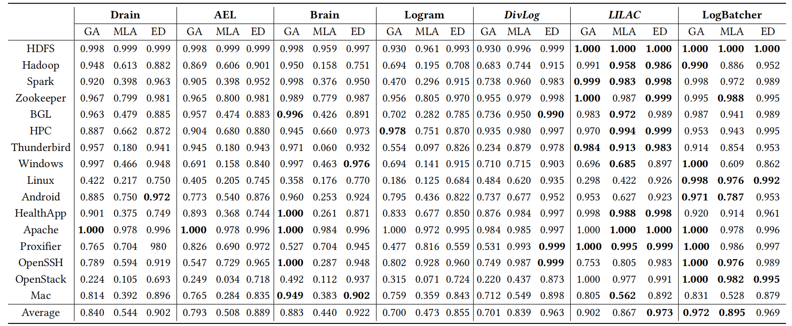
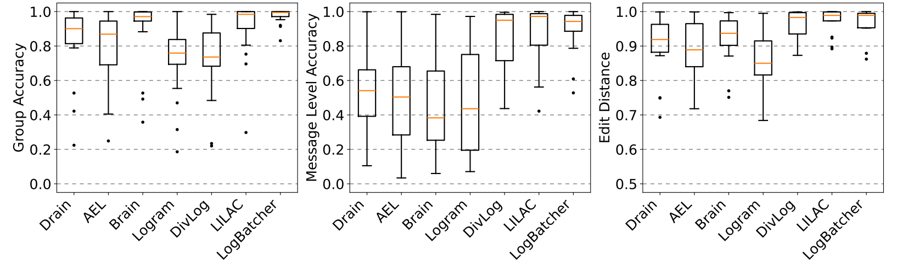
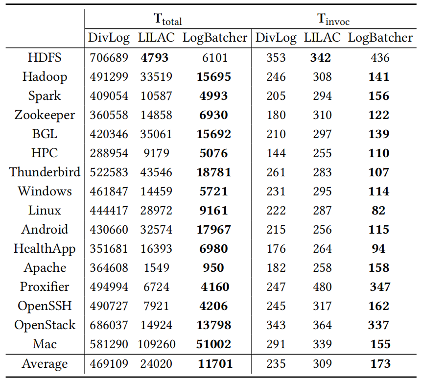
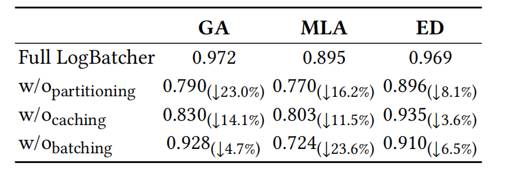
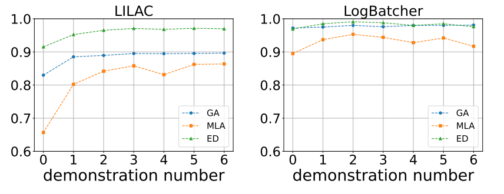
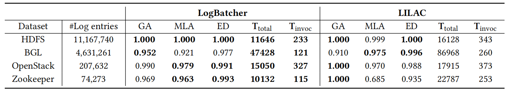
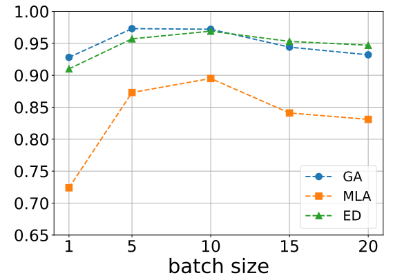
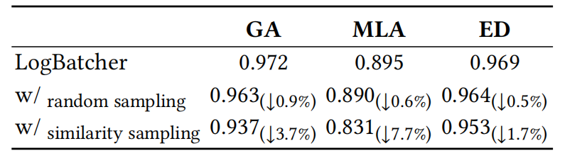
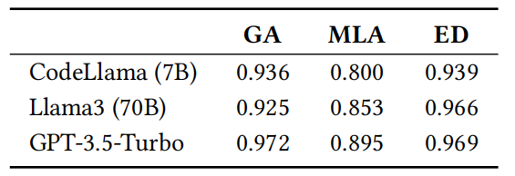

## Results

### 1.Effectiveness, Robustness and Effeciency

- Accuracy comparison with the SOTA Log parsers

- Robustness comparison with the SOTA Log parsers

- Efficiency of LLM-based Log parsers

### 2.Ablation Study

We evaluate the importance of each component by removing each of them from the framework

### 3.Scalability

- Performance with demonstrations

- Performance on large-scale datasets

### 4.Different Settings

- Batch size

- Sampling method

- LLM selection

