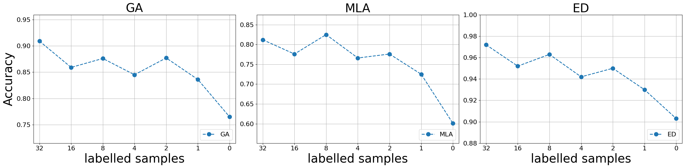

# A1

|   **LILAC**  |   **GA**  |  **MLA**  |   **ED**  |  **FGA**  |  **FTA**  |
|:------------:|:---------:|:---------:|:---------:|:---------:|:---------:|
| **32 shots** |    0.909  |    0.812  |    0.972  |    0.951  |    0.839  |
| **16 shots** |    0.859  |    0.776  |    0.952  |    0.939  |    0.808  |
|  **8 shots** |    0.876  |    0.825  |    0.963  |    0.927  |    0.768  |
|  **4 shots** |    0.845  |    0.766  |    0.942  |    0.915  |    0.753  |
|  **2 shots** |    0.877  |    0.776  |    0.950  |    0.904  |    0.724  |
|  **1 shots** |    0.836  |    0.725  |    0.930  |    0.904  |    0.708  |
|  **0 shots** |    0.765  |    0.601  |    0.903  |    0.824  |    0.577  |

# A2

| **LoaBatcher** | **GA** | **MLA** |  **ED** | **FGA** | **FTA** |
|:--------------:|:------:|:-------:|:-------:|:-------:|:-------:|
|      **Test 1**     |  0.974 |  0.905  | 0.972 |   0.930  |  0.803  |
|      **Test 2**     |  0.974 |  0.898  | 0.971 |   0.930  |  0.796  |
|      **Test 3**     |  0.969 |  0.899  | 0.969 |  0.931  |  0.801  |
|      **Test 4**     |  0.974 |  0.914  | 0.974 |   0.93  |  0.808  |
|      **Test 5**     |  0.980  |  0.906  | 0.973 |  0.934  |  0.803  |

